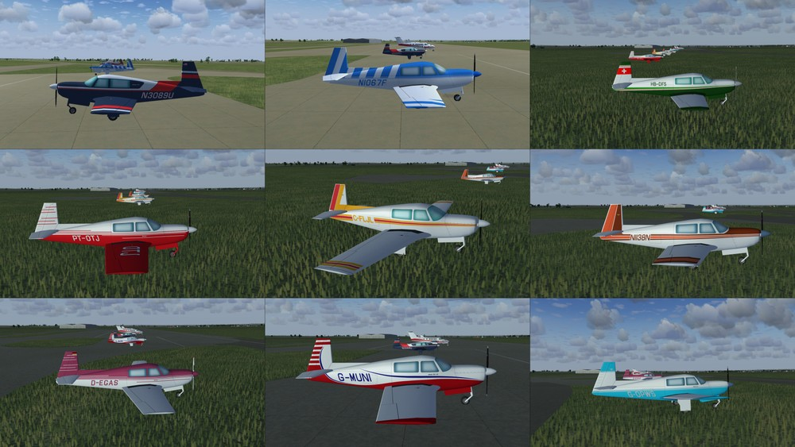

# Mooney-M20
Mooney M20 AI aircraft for use in FlightGear flight simulator.

Download the zip file and extract the "M20P" folder into the "$FG_ROOT/AI/Aircraft" folder.

To use you will need to create a traffic file, see the wiki for instructions.
 http://wiki.flightgear.org/AI_Traffic
